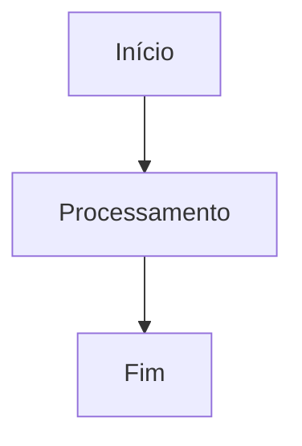

# Teste do Preview

Este arquivo reúne diferentes recursos que devem coexistir corretamente no pipeline de renderização do MD Studio.

## Markdown básico

Este é um parágrafo comum em Markdown.

Este texto contém **negrito**, *itálico* e `código inline`.

> Este é um blockquote usado para verificar a renderização padrão do Markdown.

---

## Task list

- [x] Item concluído
- [ ] Item pendente
- [ ] Outro item ainda não concluído

---

## Tabela GFM

| Recurso | Status esperado |
|---|---|
| Markdown | Renderizado |
| GFM | Renderizado |
| KaTeX | Renderizado |
| Mermaid | Renderizado |

---

## Nota de rodapé

O MD Studio deve renderizar notas de rodapé corretamente.[^1]

[^1]: Esta é uma nota de rodapé utilizada para validar o suporte GFM/Unified.

---

## Alerta

> [!NOTE]
> Este bloco deve ser reconhecido como um alerta ou callout, pois o pipeline do MD Studio inclui esse recurso.

---

## Fórmula KaTeX inline

A famosa relação entre massa e energia é:

$E = mc^2$

A fórmula acima deve ser renderizada pelo KaTeX, e não exibida literalmente entre cifrões.

---

## Fórmula KaTeX em bloco

$$
E = mc^2
$$

Outra fórmula para teste:

$$
a^2 + b^2 = c^2
$$

---

## Diagrama Mermaid

O bloco acima deve ser transformado em um diagrama Mermaid real.

---
