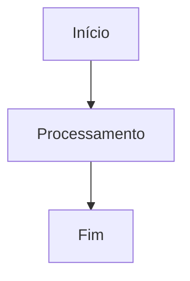
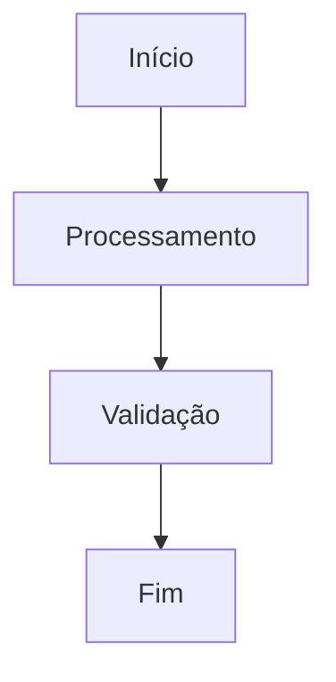
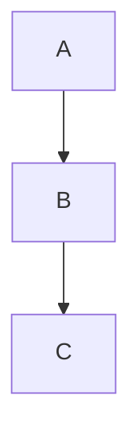
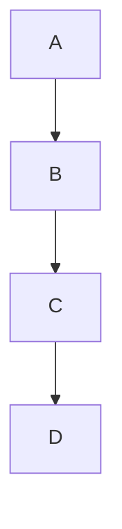
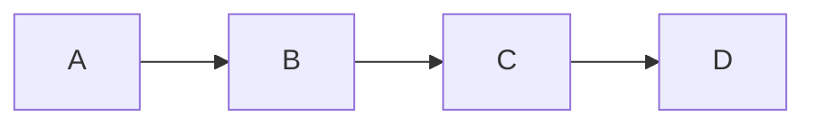
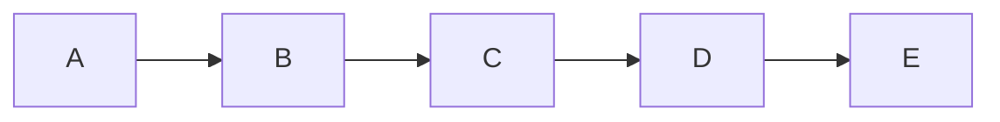

## 2. Linha de Base e Escopo do MD Studio (Release v0.2.2)

A investigação técnica toma como referência o commit oficial `3fceeec` (versão 0.2.2):

### 2.1 Requisitos Funcionais Implementados

* **Editor:** CodeMirror 6 com numeração de linhas, quebra suave (*soft wrap*), desfazer/refazer e documento ativo único. Inclui barra de ferramentas Markdown e de tabela, comandos slash (`/`), *smart paste* (URLs sobre texto e conversão de tabelas HTML/Excel para Markdown), 7 modelos estruturados acessíveis via `Ctrl+N` e hub de formatação via IPC com fallback seguro.
* **Preview:** Pipeline Unified (CommonMark + GFM com tabelas, task lists, notas de rodapé e alertas), front matter YAML com validação de esquema, KaTeX local para equações matemáticas (sem requisições CDN externas), Shiki com temas claro/escuro, diagramas Mermaid com suporte a pan/zoom, alternância fonte/diagrama e exportação gráfica em SVG/PNG. Suporta modos *source*, *preview*, *split* sincronizado e *zen*. Outline de cabeçalhos navegável.
* **Workspace e Navegação:** Abertura de pastas e arquivos por diálogos nativos do sistema operacional, associação de arquivos `.md` em instância única, árvore de arquivos lateral, busca global no workspace, Quick Switcher (`Ctrl+P`), wiki links com preenchimento automático e resolução, backlinks sob demanda, links relativos no preview, abertura de links externos pelo navegador padrão, histórico de recentes e sessão mantida em `.mdstudio/index.json`.
* **Persistência:** Salvamento e *Salvar Como* atômicos, auto-save com debounce ativo por padrão, detecção de concorrência e conflitos por hash SHA-256 (com opções: *Recarregar*, *Manter local* ou *Salvar como*), watcher de disco com filtro de eco de auto-save e recuperação de rascunhos no `localStorage` por até 90 dias.
* **Exportação:** Geração de HTML autossuficiente pelo mesmo pipeline sanitizado de preview. Suporte a PDF através da impressão nativa do sistema operacional (`window.print()`). Exportação de blocos Mermaid para arquivos SVG ou PNG.
* **Plataformas:** Distribuição para Windows em instaladores oficiais NSIS (EXE) e MSI.


### 2.2 Requisitos Não Funcionais Críticos

* Arquitetura *local-first*, funcionamento offline, ausência de serviços de nuvem e sem telemetria em segundo plano.
* Acesso ao disco executado exclusivamente pelo backend em Rust via IPC tipado com contenção estrita no diretório do workspace (*path fencing*).
* Sanitização completa contra Cross-Site Scripting (XSS) no preview e na exportação HTML.
* Gravação atômica garantida por rotina de arquivo temporário, `fsync` e substituição renomeada (*atomic rename*).

### 2.3 Fronteiras e Recursos Fora de Escopo (Falsos Bugs)

* **Em Testes (fora da release 0.2.2):** O *Presentation Mode* (F5 / Reveal.js local) possui código inicial na árvore, mas está oficialmente agendado para a v0.2.3. Não deve ser reportado como defeito na v0.2.2.
* **Explicitamente fora do produto v1:** Edição visual WYSIWYG, colaboração concorrente em tempo real, sincronização em nuvem, sistema de plugins JavaScript externos, visualização em grafo de conhecimento, abas com múltiplos documentos simultâneos e gerador tipográfico avançado de PDF via Pandoc/LaTeX.

### 2.4 Divergências Conhecidas entre Documentação (PRD) e Implementação

1. **Drag-and-Drop:** O PRD prevê arrastar arquivos e pastas do Explorador do Windows diretamente para a janela, mas a interface implementa apenas abertura por diálogo nativo ou associação de extensão no sistema operacional.
2. **Modal de Conflito:** O PRD menciona um botão para *"Comparar"* versões conflitantes, contudo a interface real restringe-se a: *Recarregar*, *Manter local* e *Salvar como*.
3. **Faixa do Auto-Save:** A documentação especifica o atraso do auto-save na faixa de 1.000 a 5.000 ms, enquanto a validação no código e na interface aceita limites entre 500 e 10.000 ms.
4. **Política de Segurança (CSP):** O documento de qualidade prevê proibição estrita de `unsafe-eval`, enquanto a configuração real do runtime Tauri (`tauri.conf.json`) inclui `unsafe-eval` e `wasm-unsafe-eval`.

---

## 3. Matriz Consolidada de Métricas de Qualidade para o MD Studio

| Dimensão de Qualidade | Métrica / Indicador | Natureza | Instrumento / Fórmula de Cálculo | Critério e Interpretação Técnica |
| --- | --- | --- | --- | --- |
| **Desempenho (Tempo)** | Tempo de inicialização (*cold start*) | Dinâmica (Direta) | Cronômetro / Gerenciador de Tarefas | Tempo até a janela apresentar interface interativa a frio. |
| **Desempenho (Tempo)** | Tempo por tarefa operacional | Dinâmica (Direta) | Cronômetro (mediana das repetições da equipe) | Eficiência e fluidez dos fluxos básicos de trabalho. |
| **Eficiência de Recursos** | Consumo de memória RAM | Dinâmica (Direta) | Gerenciador de Tarefas (Processos do Windows) | Consumo em repouso e com `notas.md` aberto no editor. |
| **Capacidade de Carga** | Estabilidade sob carga (500 linhas) | Dinâmica (Direta) | Observação de fluidez e latência de rolagem | Atraso aceitável de sincronização do preview $\le 1{,}0\text{ s}$. |
| **Confiabilidade** | Integridade após salvar e reabrir | Dinâmica (Direta) | $\frac{\text{casos com divergência de texto}}{\text{total de casos executados}} \times 100$ | Manutenção exata do conteúdo persistido (meta: $0\%$ de perda). |
| **Conformidade Funcional** | Fidelidade da visualização | Dinâmica (Direta) | $\frac{\text{elementos renderizados corretamente}}{\text{total de elementos testados}} \times 100$ | Aderência do preview à sintaxe GFM, KaTeX e Mermaid (meta: $100\%$). |
| **Eficácia de Uso** | Taxa de conclusão da tarefa | Dinâmica (Indireta) | $\frac{\text{tarefas concluídas com sucesso}}{\text{total de tentativas}} \times 100$ | Capacidade do usuário de finalizar fluxos funcionais sem bloqueios. |
| **Operabilidade** | Erros ou bloqueios operacionais | Dinâmica (Direta) | Contagem de impasses, travamentos e falhas de comando | Identificação de pontos de atrito no fluxo de uso. |
| **Operabilidade** | Esforço mínimo de interação | Estática (Indireta) | Contagem de passos mínimos (cliques / atalhos) | Ergonomia de comandos e facilidade de navegação por teclado. |
| **Satisfação** | Usabilidade percebida | Subjetiva quantificada | Escala Likert de 1 a 5 (1: difícil; 5: fácil) | Percepção de conforto do usuário (indicador, não prova de defeito). |
| **Rigor de Investigação** | Taxa de reprodutibilidade | Metamétrica de Teste | $\frac{\text{repetições com mesma falha}}{\text{total de tentativas de repetição}}$ (ex.: 3 de 4) | Separação de anomalias efêmeras de comportamentos deterministas. |
| **Cobertura de Teste** | Cobertura do plano de teste | Métrica de Processo | $\frac{\text{casos de teste executados}}{\text{casos planejados}} \times 100$ | Extensão do plano coberta (100% não garante ausência de falhas). |


## Trilha 01: Editor, Formatação e Templates
- Requisito Base: CodeMirror 6 com numeração, soft wrap, slash commands (/), inserção de 7 templates via Ctrl+N e atalhos de formatação sem corrupção de blocos.
- Massa de Dados: Ficheiro limpo notas.md

### Caso TC-01: Inserção e Validação dos Templates (Ctrl+N)

- Abrir a aplicação e acionar o atalho Ctrl+N.
- Percorrer sequencialmente os 7 templates disponíveis e aplicar cada um deles no editor.
- Verificar se o cursor e a estrutura Markdown são inseridos corretamente sem travamentos.

- Métrica Coletada:
$$\text{Taxa de Sucesso dos Templates} = \frac{\text{templates inseridos corretamente}}{7} \times 100$$

- Critério de Aceitação: $100\%$ de inserção bem-sucedida; esforço $\le 2$ teclas/cliques por template.

### Caso TC-02: Slash Commands e Hub de Formatação

- Em uma linha em branco de notas.md, digitar / e avaliar a exibição do menu de comandos.
- Inserir uma tabela e aplicar a formatação do bloco.
- Forçar formatação em texto com sintaxe mista e verificar integridade estrutural.
- Métrica Coletada: Erros ou Bloqueios (contagem de comandos que falham ou que corrompem o bloco).
- Critério de Aceitação: Zero corrupções de texto; menu responsivo em $\le 0{,}5\text{ s}$.

## Trilha 02: Pipeline de Preview, KaTeX e Mermaid
- Requisito Base: Pipeline Unified (CommonMark + GFM: tabelas, task lists, notas de rodapé, alertas), fórmulas matemáticas com KaTeX local e diagramas Mermaid com pan/zoom e exportação SVG/PNG.
- Massa de Dados: Ficheiro notas.md contendo um cabeçalho H1, uma task list, uma tabela GFM, uma equação KaTeX ($E = mc^2$) e um diagrama Mermaid básico (graph TD; A-->B;).

### Caso TC-03: Fidelidade da Visualização Sintática
- Colar a massa de dados sintática no editor em modo Split (lado a lado).
- Comparar visualmente cada elemento renderizado no preview com a especificação esperada do Markdown.
- Métrica Coletada:$$\text{Fidelidade de Visualização} = \frac{\text{elementos renderizados corretamente}}{\text{5 elementos de sintaxe testados}} \times 100$$
- Critério de Aceitação: $100\%$ de fidelidade; fórmulas matemáticas renderizadas sem requisição de rede (KaTeX local).

### Caso TC-04: HardTest

## Objetivo

Validar o pipeline de renderização do Preview do MD Studio, garantindo que recursos de Markdown padrão, GFM, KaTeX e Mermaid funcionem corretamente no mesmo documento e no mesmo ciclo de atualização.

O teste deve verificar:

- Markdown CommonMark;
- GFM;
- task lists;
- tabelas;
- notas de rodapé;
- alertas;
- fórmulas matemáticas com KaTeX local;
- diagramas Mermaid;
- pan e zoom em diagramas Mermaid;
- exportação Mermaid para SVG;
- exportação Mermaid para PNG;
- atualização dinâmica do Preview após edição;
- ausência de erros ou duplicações após re-renderização.

---

## Requisito base

O pipeline de Preview deve utilizar Unified com suporte a:

- CommonMark;
- GFM;
- tabelas;
- task lists;
- notas de rodapé;
- alertas;
- KaTeX local;
- Mermaid.

Diagramas Mermaid devem suportar:

- renderização;
- pan;
- zoom;
- exportação para SVG;
- exportação para PNG.

---

# Massa de dados principal

O conteúdo abaixo deve ser salvo como:

`notas.md`

---

# Teste do Preview

Este arquivo reúne diferentes recursos que devem coexistir corretamente no pipeline de renderização do MD Studio.

## Markdown básico

Este é um parágrafo comum em Markdown.

Este texto contém **negrito**, *itálico* e `código inline`.

> Este é um blockquote usado para verificar a renderização padrão do Markdown.

---

## Task list

- [x] Item concluído
- [ ] Item pendente
- [ ] Outro item ainda não concluído

---

## Tabela GFM

| Recurso | Status esperado |
|---|---|
| Markdown | Renderizado |
| GFM | Renderizado |
| KaTeX | Renderizado |
| Mermaid | Renderizado |

---

## Nota de rodapé

O MD Studio deve renderizar notas de rodapé corretamente.[^1]

[^1]: Esta é uma nota de rodapé utilizada para validar o suporte GFM/Unified.

---

## Alerta

> [!NOTE]
> Este bloco deve ser reconhecido como um alerta ou callout, caso o pipeline do MD Studio implemente esse recurso.

---

## Fórmula KaTeX inline

A famosa relação entre massa e energia é:

$E = mc^2$

A fórmula acima deve ser renderizada pelo KaTeX, e não exibida literalmente entre cifrões.

---

## Fórmula KaTeX em bloco

$$
E = mc^2
$$

Outra fórmula para teste:

$$
a^2 + b^2 = c^2
$$

---

## Diagrama Mermaid



O bloco acima deve ser transformado em um diagrama Mermaid real.

---

# Procedimento de teste

## Etapa 1 — Abrir o arquivo

1. Inicie o MD Studio.
2. Abra o arquivo `notas.md`.
3. Ative o Preview.
4. Verifique se o documento é processado sem erro.
5. Abra o console de desenvolvimento da aplicação, se disponível.
6. Confirme que não existem exceções relacionadas ao pipeline de Markdown, KaTeX ou Mermaid.

---

## Etapa 2 — Validar Markdown e GFM

Verifique os seguintes pontos:

### Cabeçalho

O texto:

`# Teste do Preview`

deve aparecer como um cabeçalho H1 real.

### Formatação básica

Os seguintes elementos devem ser renderizados corretamente:

- negrito;
- itálico;
- código inline;
- blockquote.

### Task list

A lista:

- [x] Item concluído
- [ ] Item pendente

deve aparecer visualmente com checkboxes.

O primeiro item deve aparecer marcado.

Os demais devem aparecer desmarcados.

### Tabela

A tabela GFM deve ser convertida em uma tabela HTML real.

As quatro linhas de dados devem estar visíveis.

### Nota de rodapé

A referência de nota de rodapé deve ser clicável ou navegável conforme a implementação adotada.

O conteúdo da nota deve aparecer corretamente no Preview.

### Alerta

O bloco `[!NOTE]` deve ser renderizado conforme o comportamento definido pelo MD Studio.

Caso alertas sejam estilizados visualmente, o estilo deve aparecer corretamente.

---

# Etapa 3 — Validar KaTeX

Verifique a expressão:

`$E = mc^2$`

Ela não deve aparecer literalmente com os caracteres `$`.

Ela deve ser convertida em uma fórmula matemática tipografada.

Verifique também as fórmulas em bloco:

`E = mc^2`

e

`a^2 + b^2 = c^2`

As duas devem ser renderizadas corretamente.

---

## Teste de funcionamento offline do KaTeX

1. Feche o arquivo.
2. Desative a conexão de rede.
3. Abra novamente o MD Studio.
4. Abra `notas.md`.
5. Ative o Preview.

### Resultado esperado

As fórmulas devem continuar sendo renderizadas.

Se o KaTeX deixar de funcionar sem conexão, o requisito "KaTeX local" não está atendido.

---

# Etapa 4 — Validar Mermaid

O seguinte bloco:


deve aparecer como um diagrama visual.

O código-fonte Mermaid não deve ser exibido como um bloco de código convencional no Preview final.

---

## Pan

1. Posicione o cursor sobre o diagrama.
2. Acione o mecanismo de pan.
3. Arraste o diagrama horizontalmente.
4. Arraste o diagrama verticalmente.

### Resultado esperado

O conteúdo do diagrama deve se mover dentro da área de visualização sem modificar o documento Markdown.

---

## Zoom

1. Aumente o zoom do diagrama.
2. Reduza o zoom.
3. Repita o processo várias vezes.

### Resultado esperado

O diagrama deve aumentar e diminuir de escala sem:

- desaparecer;
- ser cortado incorretamente;
- duplicar elementos;
- perder conexões;
- alterar o conteúdo Markdown.

---

# Etapa 5 — Exportação SVG

1. Localize a opção de exportação do diagrama Mermaid.
2. Escolha SVG.
3. Exporte o diagrama.

### Resultado esperado

Deve ser gerado um arquivo `.svg`.

O arquivo deve:

- abrir corretamente em navegador;
- conter o diagrama completo;
- preservar textos;
- preservar conexões;
- preservar nós;
- manter qualidade vetorial.

O SVG não deve ser apenas uma captura rasterizada incorporada.

---

# Etapa 6 — Exportação PNG

1. Exporte o mesmo diagrama para PNG.
2. Abra o arquivo gerado.

### Resultado esperado

O PNG deve:

- abrir corretamente;
- conter todos os nós;
- conter todas as conexões;
- conter todos os textos;
- apresentar resolução adequada;
- corresponder visualmente ao diagrama mostrado no Preview.

---

# Etapa 7 — Atualização dinâmica do KaTeX

Com o Preview aberto, altere:

```markdown
$E = mc^2$
```

para:

```markdown
$a^2 + b^2 = c^2$
```

### Resultado esperado

O Preview deve atualizar a fórmula automaticamente.

Não deve ser necessário:

- fechar o arquivo;
- recarregar a aplicação;
- reiniciar o MD Studio.

Também não devem surgir:

- fórmulas duplicadas;
- resíduos da fórmula anterior;
- erros no console.

---

# Etapa 8 — Atualização dinâmica do Mermaid

Substitua:


por:



### Resultado esperado

O Preview deve substituir o diagrama anterior pelo novo.

O novo diagrama deve conter quatro nós:

- Início;
- Processamento;
- Validação;
- Fim.

Não devem existir simultaneamente a versão antiga e a nova.

---

# Etapa 9 — Edição repetida do Mermaid

Altere o diagrama Mermaid pelo menos cinco vezes consecutivas.

Exemplo de sequência:


Depois:



Depois:



Depois:



Depois:



### Resultado esperado

Cada edição deve substituir corretamente a renderização anterior.

Não devem ocorrer:

- diagramas duplicados;
- SVGs abandonados no DOM;
- aumento progressivo do número de elementos;
- erros Mermaid;
- travamentos;
- crescimento perceptível e contínuo do uso de memória.

---

# Etapa 10 — Teste de erro Mermaid

Substitua temporariamente o diagrama por uma sintaxe inválida:

```mermaid
graph TD;
    A-->
```

### Resultado esperado

O MD Studio deve tratar o erro de forma controlada.

O erro Mermaid:

- não deve derrubar o Preview inteiro;
- não deve impedir a renderização do restante do Markdown;
- deve apresentar indicação compreensível de erro;
- não deve causar crash da aplicação.

Depois, restaure um diagrama válido:


### Resultado esperado

O Mermaid deve voltar a funcionar normalmente sem reiniciar o MD Studio.

---

# Etapa 11 — Teste de erro KaTeX

Insira temporariamente uma expressão matemática inválida, por exemplo:

```markdown
$\frac{1}{`
```

### Resultado esperado

O erro deve ficar restrito ao elemento matemático.

O restante do Preview deve continuar funcionando.

Depois, substitua novamente por:

```markdown
$\frac{1}{2}$
```

### Resultado esperado

A fórmula deve voltar a ser renderizada corretamente.

---

# Etapa 12 — Coexistência dos componentes

Restaure o documento completo contendo simultaneamente:

- H1;
- Markdown básico;
- blockquote;
- task list;
- tabela;
- nota de rodapé;
- alerta;
- KaTeX inline;
- KaTeX em bloco;
- Mermaid.

### Resultado esperado

Todos os componentes devem coexistir no mesmo Preview.

A ativação de um plugin ou transformador não deve quebrar os demais.

---

# Critérios de aprovação

A Trilha 02 deve ser considerada aprovada somente se todos os critérios abaixo forem atendidos.

- [ ] H1 renderizado corretamente.
- [ ] Markdown básico renderizado corretamente.
- [ ] Negrito funcionando.
- [ ] Itálico funcionando.
- [ ] Código inline funcionando.
- [ ] Blockquote funcionando.
- [ ] Task list GFM funcionando.
- [ ] Tabela GFM funcionando.
- [ ] Nota de rodapé funcionando.
- [ ] Alertas funcionando.
- [ ] KaTeX inline funcionando.
- [ ] KaTeX em bloco funcionando.
- [ ] KaTeX funcionando offline.
- [ ] Mermaid renderizado corretamente.
- [ ] Pan funcionando.
- [ ] Zoom funcionando.
- [ ] Exportação Mermaid para SVG funcionando.
- [ ] SVG exportado válido.
- [ ] Exportação Mermaid para PNG funcionando.
- [ ] PNG exportado válido.
- [ ] Preview atualizado após edição de KaTeX.
- [ ] Preview atualizado após edição de Mermaid.
- [ ] Mermaid não é duplicado após re-renderização.
- [ ] Erro Mermaid não derruba o Preview.
- [ ] Recuperação após erro Mermaid funciona.
- [ ] Erro KaTeX não derruba o Preview.
- [ ] Recuperação após erro KaTeX funciona.
- [ ] Todos os recursos coexistem no mesmo documento.
- [ ] Nenhum erro inesperado é registrado no console.

---

# Resultado do teste

## Status

- [ ] APROVADO
- [ ] APROVADO COM RESSALVAS
- [ ] REPROVADO

## Observações

Preencher após a execução do teste.

```text
Data:

Versão do MD Studio:

Sistema operacional:

Versão do navegador/WebView/Electron:

Resultado:

Problemas encontrados:

Logs relevantes:

Arquivos exportados:

Observações adicionais:
```

---

# Critério final

O teste passa somente quando o mesmo arquivo `notas.md` pode ser aberto, editado e renderizado repetidamente com todos os recursos ativos, sem erros de integração entre Unified, GFM, KaTeX e Mermaid.

A aprovação visual isolada não é suficiente.

Também devem funcionar corretamente:

- re-renderização;
- atualização após edição;
- tratamento de erros;
- operação offline do KaTeX;
- interação com Mermaid;
- exportação SVG;
- exportação PNG.

### QA-MET-[Número] — [Título claro e mensurável][cite: 7]

- Requisito Funcional Relacionado: [Ex.: Persistência / Detecção de Conflitos]
- Categoria: Falha / Inconsistência Doc vs Código / Melhoria / Dúvida
- Ambiente: MD Studio v0.2.2[cite: 1, 7], Windows [10/11] x64[cite: 1, 7], Instalador [EXE/MSI][cite: 1, 7]
- Métrica Obtida: [Ex.: Reprodutibilidade 3/3; Latência de 3,4s; Faixa de 500-10000ms]
- Passos de Reprodução:
  1. ...
  2. ...[cite: 7]
  3. ...[cite: 7]
- Resultado Esperado (Critério/Documento): ...[cite: 7]
- Resultado Observado (Medição real): ...[cite: 7]
- Impacto Prático para o Usuário: ...[cite: 7]
- Severidade Proposta: Baixa / Média / Alta / Crítica (com justificativa técnica)[cite: 7]
- Prioridade Proposta: Baixa / Média / Alta (com justificativa de urgência)[cite: 7]
- Evidência Anexa: [Nome do arquivo fictício de teste ou print sanitizado][cite: 7]
